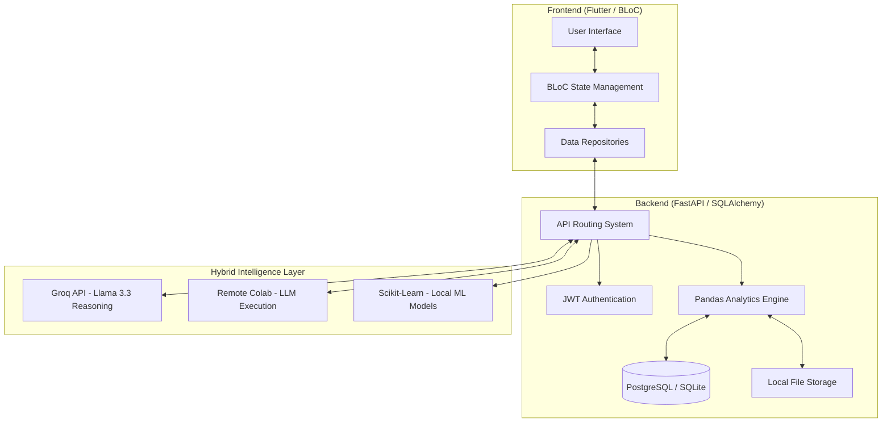

# AI Decision Intelligence Platform

An end-to-end, enterprise-grade platform that transforms raw data into strategic business decisions. By combining a high-performance **FastAPI** backend with a modern **Flutter** frontend, the platform provides a seamless, cross-platform experience (Web, Android, iOS) powered by a cutting-edge **Hybrid AI Intelligence Model**.

---

## **Architecture Deep-Dive** 🏗️

The platform is designed with a "Privacy-First" modular architecture.

---

## **The End-to-End User Journey** 🔄

1.  **Secure Entry**: Users sign up and log in via JWT-secured authentication.
2.  **Data Ingestion**: Upload local CSV/Excel files or import directly from Google Sheets.
3.  **Automated Profiling**: The system instantly analyzes the dataset, identifying schemas and generating descriptive statistics.
4.  **Natural Exploration**: Users ask questions in plain English. The AI generates and executes code locally to find answers.
5.  **Strategic Prediction**: Users select key metrics to forecast future trends with AI-narrated explanations.
6.  **Decision Action**: Based on insights, the AI generates 10-point strategic action plans to solve business problems.

---

## **Core Features & Capabilities** 🚀

### **1. Secure User Management**
- **Functionality**: Full authentication suite including Signup, OAuth2 Login, Profile Management, and Password Reset.
- **Tech**: Passlib (Bcrypt) for hashing, Python-Jose for JWT tokens.

### **2. Advanced Data Ingestion**
- **Local Uploads**: Support for CSV, XLSX, and XLS files.
- **Cloud Import**: Direct import from **Google Sheets** URLs.
- **Bulk Management**: Multi-select deletion and organized dataset tracking.

### **3. AI Data Chat (Ask & Explore)**
- **Functionality**: A conversational interface that "understands" your data.
- **Example**: *"Who are our top 10 customers by lifetime value in the East region?"*
- **End-to-End Flow**:
    1. AI analyzes schema.
    2. AI generates Python/Pandas code.
    3. Backend executes code safely via `exec()` on the local server.
    4. Result is returned as a formatted answer + the underlying code for transparency.

### **4. Deep Analytical Insights**
- **Descriptive Statistics**: Automatic calculation of mean, median, standard deviation, and quartiles.
- **Correlation Mapping**: Identify hidden relationships between numerical variables (e.g., does high `Discount` actually lead to higher `Profit`?).
- **Suggested Questions**: AI proactively suggests 3 insightful questions based on your data headers to jumpstart analysis.

### **5. Predictive Forecasting**
- **Functionality**: Turn historical data points into future predictions.
- **Example**: Select `Weekly_Sales`.
- **Output**: A predicted value for the next period (e.g., `15,400`) accompanied by an AI explanation: *"Based on the 5-period trend, we expect a 12% growth due to the recent upward momentum 📈."*

### **6. Strategic AI Action Plans**
- **Functionality**: Transforms a data insight into a roadmap.
- **Output**: 10 detailed strategies, each containing:
    - 💡 **Strategic Title**
    - 📝 **Implementation Plan** (3-4 sentences)
    - 📊 **Expected Business Impact**

---

## **Advanced Machine Learning Engine** 🧠

Beyond standard analysis, the backend contains a dedicated **ML Service** for deeper intelligence:
- **Anomaly Detection**: Uses `IsolationForest` to identify outliers or fraudulent transactions in your data.
- **Customer Clustering**: Uses `KMeans` to automatically segment your data into logical groups (e.g., High-Value vs. At-Risk customers).
- **Feature Importance**: Uses `RandomForestRegressor` to determine which variables most significantly impact your target metric (e.g., "What actually drives sales?").

---

## **Technical Implementation Details** 🛠️

### **Hybrid Intelligence Model**
The platform solves the "Data Privacy vs. AI Power" trade-off:
- **Reasoning (Cloud)**: Complex logic and code synthesis are handled by Llama-3.3-70B (via Groq) or Mistral/Qwen (via Colab).
- **Execution (Local)**: Your actual row-level data **never leaves your server**. Only the generated code is executed locally against your dataframes.

### **Tech Stack**
- **Frontend**: Flutter, BLoC, Lucide Icons, Google Fonts.
- **Backend**: FastAPI, Pandas, Scikit-learn, SQLAlchemy, Uvicorn.
- **Database**: PostgreSQL (Production) / SQLite (Development).
- **AI Integration**: Groq SDK, LangChain-style custom pipelines.

---

## **Installation & Setup**

### **Backend**
1. Navigate to `ai-decision-intelligence-platform`.
2. `pip install -r requirements.txt`.
3. Configure `.env` (Database URL, Groq API Key).
4. `uvicorn app.main:app --reload`.

### **Frontend**
1. Navigate to `ai_decision_intelligence_frontend`.
2. `flutter pub get`.
3. Set your API URL in `lib/core/constants/api_constants.dart`.
4. `flutter run`.

---

## **License**
Enterprise Proprietary License. All rights reserved.
